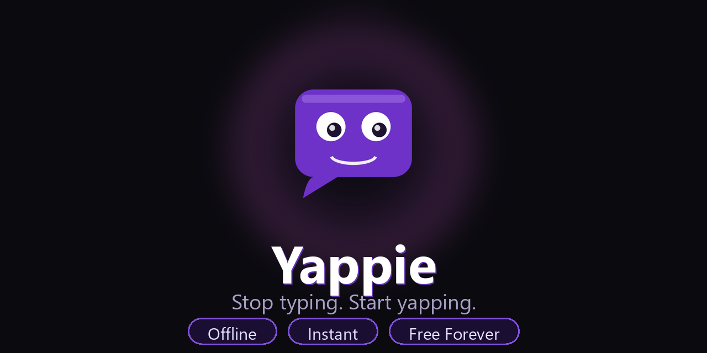

<p align="center">
  
</p>

<h1 align="center">Yappie 🗣️</h1>

<p align="center"><strong>Stop typing. Start yapping.</strong></p>

<p align="center">
  <em>Free, offline voice dictation for Windows. No cloud. No subscription. No cap.</em>
</p>

Hold a hotkey, speak, release — your words appear wherever your cursor is. Powered by whisper.cpp, running 100% on your machine.


---

## Why Yappie?

> Wispr Flow costs $17/month. Yappie costs $0/month. Forever.

| Feature | Yappie | Wispr Flow |
|---------|--------|------------|
| Price | **Free** | $17/month |
| Offline | **✅ 100%** | ❌ Cloud |
| Open Source | **✅** | ❌ |
| Privacy | **✅ Local only** | ❌ Cloud processing |
| Platform | Windows | Mac/Windows |

---

## Download

Get the latest from [Releases](https://github.com/birbusTeam-oss/Yappie/releases):
- **Yappie.exe** — portable, just run it

No install required. First launch auto-downloads the speech engine (~150MB one-time). After that, everything runs locally — forever.

---

## How It Works

1. Launch Yappie — a small purple dot appears at the bottom of your screen
2. Hold **Ctrl+Alt** and speak
3. Release — text appears at your cursor

That's it. Works everywhere: browsers, text editors, Slack, Notion, Discord — anywhere you can type.

---

## Features

### Core
- 🎙️ **Fully offline** — whisper.cpp runs locally, nothing leaves your machine
- ⚡ **Hold-to-talk** — hold Ctrl+Alt, speak, release
- 🤖 **Auto-setup** — downloads whisper.cpp + model on first launch
- 🚀 **Fast** — model pre-warming, greedy decoding, silence trimming

### UI
- 💜 **Floating overlay** — glass-effect pill with animated states
- 🔴 **Recording indicator** — pulsing dot with live timer
- ⏳ **Processing animation** — spinning dots while transcribing
- ✅ **Success feedback** — word count display on completion
- 🪟 **System tray** — session stats, history, config access

### Smart
- 🧹 **Filler removal** — auto-removes um, uh, er
- 📋 **Transcription history** — last 200 dictations saved
- 🔤 **Text snippets** — custom phrase expansion
- 📊 **Session stats** — track dictations and word count
- ⚙️ **Configurable** — hotkey, language, threads, and more

---

## System Tray Menu

Right-click the Yappie icon to access:

| Item | Description |
|------|-------------|
| ⚡ Status | Current state + hotkey reminder |
| 📊 Stats | Dictations & words this session |
| 📋 View History | Open transcription log |
| ⚙️ Open Config | Edit settings in Notepad |
| 📄 View Logs | Open debug log |
| 🚀 Start with Windows | Auto-launch toggle |
| ✖ Quit | Exit Yappie |

---

## Configuration

Config lives at `%APPDATA%\Yappie\config.json`:

```json
{
  "hotkey": "ctrl+alt",
  "model": "tiny.en",
  "language": "en",
  "threads": 4,
  "remove_fillers": true,
  "log_transcriptions": true,
  "play_sounds": true,
  "auto_capitalize": true,
  "add_punctuation": true
}
```

### Options

| Setting | Default | Description |
|---------|---------|-------------|
| `hotkey` | `ctrl+alt` | Hold-to-talk combo (`ctrl+alt`, `ctrl+shift`, `alt+shift`) |
| `language` | `en` | Whisper language code |
| `threads` | `4` | CPU threads for transcription |
| `remove_fillers` | `true` | Strip um, uh, er from output |
| `log_transcriptions` | `true` | Save history to disk |
| `play_sounds` | `true` | Play sound on success |

---

## Text Snippets

Create custom expansions in `%APPDATA%\Yappie\snippets.json`:

```json
{
  "snippets": {
    "my email": "john@example.com",
    "my address": "123 Main St, Anytown USA"
  }
}
```

Say "my email" and it expands to the full address.

---

## Build from Source

```bash
git clone https://github.com/birbusTeam-oss/Yappie.git
cd Yappie
go install github.com/tc-hib/go-winres@latest
go-winres make
GOOS=windows GOARCH=amd64 go build -ldflags="-H windowsgui -s -w" -o Yappie.exe ./cmd/quill
```

## Requirements

- Windows 10/11 (x64)
- A microphone
- ~150MB disk space (whisper + model, auto-downloaded)

---

## License

MIT

---

Built by [Birbus Team](https://github.com/birbusTeam-oss) · *Stop typing. Start yapping.* 🗣️
